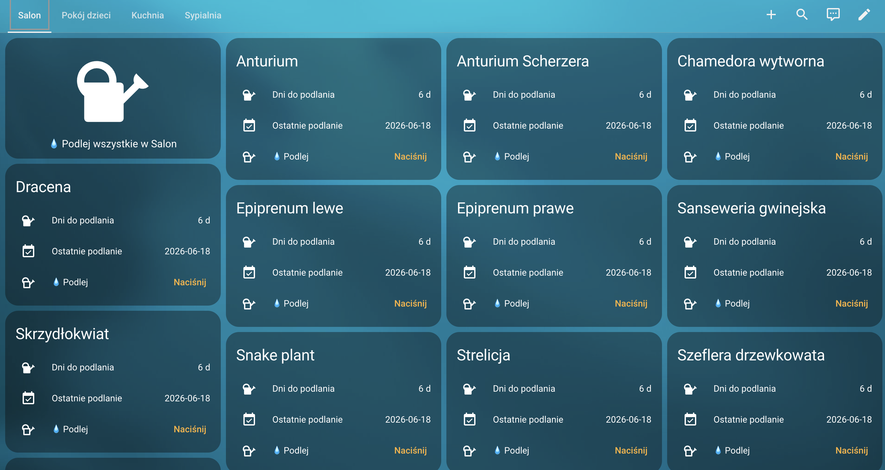

# PlantLover — Home Assistant Integration

Home Assistant integration for [PlantLover](https://github.com/lukaszgdk/plantlover) — a self-hosted plant management app.



## Features

- Sensors for each plant: last watered, next watering, days until watering
- **Water** button for each plant
- Auto-refresh every 5 minutes

## Installation via HACS

1. In HACS → **Custom repositories** → add `https://github.com/lukaszgdk/plantlover-ha` as **Integration**
2. Find **PlantLover** in HACS and install
3. Restart Home Assistant
4. Settings → Devices & Services → **Add Integration** → PlantLover
5. Enter the URL of your PlantLover instance (e.g. `http://192.168.1.100:8000`)

## Lovelace Dashboard

A ready-to-use `dashboard.yaml` is included in the repository.

**Option A — auto-entities (automatic, always up to date):**

1. Install via HACS frontend: [auto-entities](https://github.com/thomasloven/lovelace-auto-entities)
2. In HA: Settings → Dashboards → Add Dashboard → from YAML → paste the contents of `dashboard.yaml`

**Option B — personalised YAML with exact entities:**

```bash
GET http://<plantlover-address>/api/plants/ha-dashboard
```

This endpoint generates a YAML config with entities for each of your plants. Copy the response into HA.

## Requirements

- A running [PlantLover](https://github.com/lukaszgdk/plantlover) instance
- Home Assistant 2023.1+
